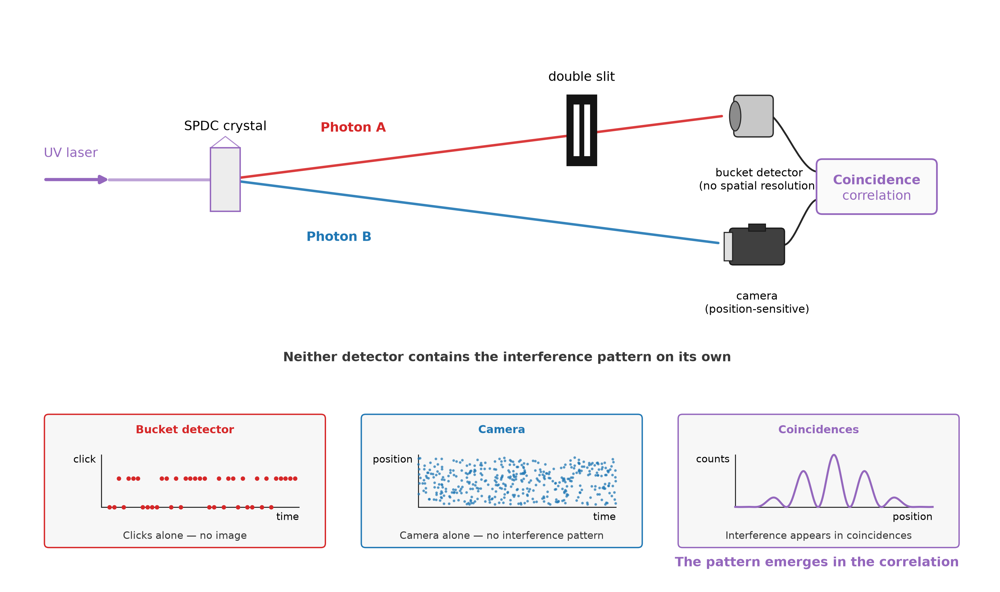
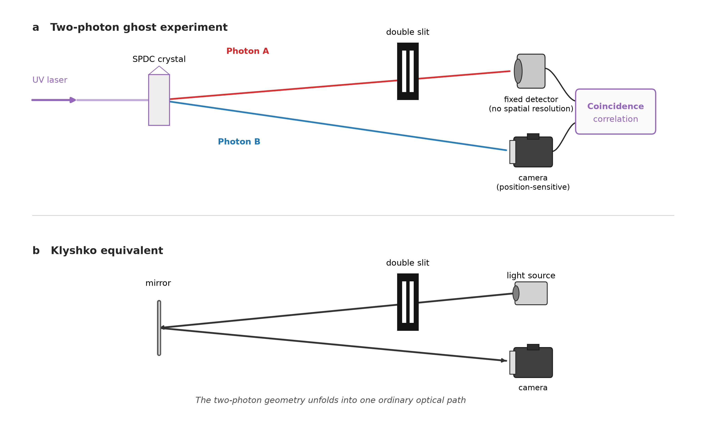
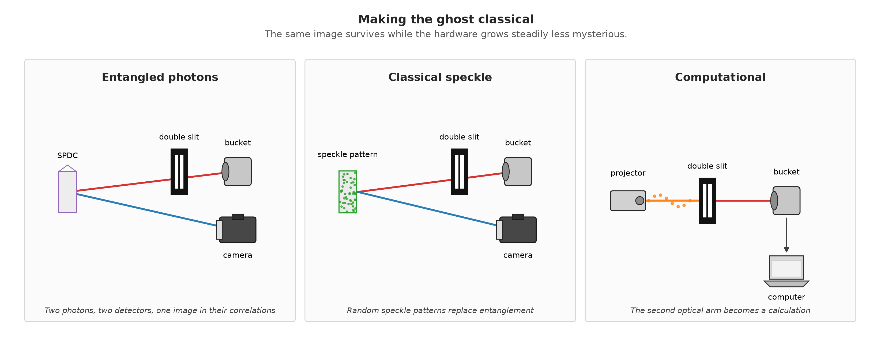

# Who Needs a Double Slit Anyway?

**The double-slit experiment is the most famous demonstration in quantum physics. What happens when the photon making the fringes never passes through either slit?**

---

Almost every popular account of quantum mechanics ends up in the same place. We send photons one at a time toward a pair of slits. Each photon lands as a single dot on the screen. But after enough of them, an interference pattern builds up — bright and dark bands that seem to require each photon to have somehow explored both paths at once.

So, what happens if we take the slits out of the path of the photon that actually makes the pattern?

---

## The photon that was never there

In 1995, physicists showed something that looked close to impossible. Entangled photon pairs could build up an image on a detector whose own photons had never touched the object at all [1].

Researchers called the effect ‘ghost imaging’, and the name fits the strange division of labour involved. The light that touches the object gets detected without ever forming an image. The detector that *does* form the image receives light that never touched the object. The image only exists in the correlation between the two detection records — neither record holds it on its own.

That same year, a separate group pushed the idea somewhere more familiar: they swapped the object for a double slit [2].

One photon passed through the slits and landed on a detector with no spatial resolution at all — a fixed detector that just registers whether a photon arrived, nothing more. Its entangled partner travelled a separate path to a position-sensitive detector.

Neither detector, on its own, shows an interference pattern.

But compare the two detection records, keep only the coincident events, and fringes appear.

The photon whose position built up that interference pattern had never gone through either slit.

> **The photon that creates the interference pattern never passed through the slits. Its entangled partner did — and landed on a detector that recorded no image at all.**

**Figure 1. The ghost double-slit experiment. One photon passes through a double slit and reaches a fixed detector with no spatial resolution. Its entangled partner travels directly to a position-sensitive detector. Neither detector reveals an interference pattern by itself. The fringes only appear once the two detection records are correlated.**

*Alt text: Schematic of a ghost interference experiment. A source produces entangled photon pairs. One path contains a double slit followed by a single-pixel fixed detector. The other path leads to a scanning detector. An arrow labelled "coincidences" connects the two detectors to a graph showing an interference pattern.*

---

## The oldest rule still applies

Anyone who knows the double-slit experiment also knows its most famous rule: find out which slit the photon went through, and the interference disappears.

The ghost version obeys the same rule — just spread across two photons instead of one.

If we change the detector behind the slits so that its click reveals which slit the first photon passed through, the fringes in the coincidence pattern vanish [3]. Nothing changes in the other arm. That photon still never comes near the slits.

What changes is the information available once we compare the two records.

In the ordinary double-slit experiment, the path information and the fringes belong to the same photon. Here, the path information gets recorded on one side and the interference pattern shows up on the other — and yet the same trade-off holds.

So the old quantum rule still applies. We just have to enforce it nonlocally.

> **Which-path information kills interference — even when the path is here and the fringes are over there.**

---

## How does the ghost know about the slits?

There is a nice way to see why this works, and we owe it to Klyshko [4,5].

Imagine running one arm of the experiment backwards. Replace the fixed detector with a light source, and replace the nonlinear crystal with a mirror. Light now travels from the detector side, back through the double slit, reflects off the mirror, and continues along the second arm to the camera.

The strange two-photon experiment unfolds into an ordinary optical system.

And that ordinary system predicts the same image geometry and the same interference pattern that we actually measure in coincidence in the ghost experiment [4,5].

Note that this doesn’t mean a photon literally travels backwards in time — the Klyshko picture is a calculational trick, but a genuinely useful one. Magnification, image position, diffraction: it all turns back into ordinary optics.

Which triggers the obvious next question. If a classical optical picture predicts the ghost this well, how much of the effect is actually quantum?

> **Unfold the entangled pair into a single classical light path, and ordinary optics predicts every detail of the ghost.**

<!-- FIGURE 2 -->

**Figure 2. The Klyshko picture. Top: the two-photon ghost experiment. Bottom: replace the fixed detector with a light source and the SPDC crystal with a mirror. The two arms then unfold into a single classical optical path through the double slit to the camera.**

*Alt text: Top: the two-photon ghost experiment. Bottom: replace the fixed detector with a light source and the SPDC crystal with a mirror, and the two arms unfold into a single classical optical path from the source, through the double slit, to the camera. The ordinary optical system reproduces the geometry of the ghost experiment.*

---

## Then the entanglement became optional

It turns out the ghost image itself doesn’t need entanglement at all.

Take a laser, pass it through a rotating ground-glass screen, and we get a constantly shifting speckle pattern. Split that pattern into two copies with a beam splitter. Send one copy through the object to a fixed detector, and record the other copy with a camera.

Neither measurement means anything on its own.

But correlate the signal with the recorded speckle patterns, and the image appears anyway [6,7].

No entangled photons required.

So classical correlations alone can reproduce both ghost images and ghost interference. And researchers didn’t stop there — they stripped the apparatus down further still. If the illumination patterns are generated deliberately with a spatial light modulator, the second beam doesn’t even need to be measured [8,9].

At that point the setup has collapsed to its bare essentials: a structured light source, the object, a single-pixel detector, and a computer.

The ghost image survives anyway.

> **Remove the entanglement. Remove the second beam. Replace the camera with a calculation. The ghost image remains.**

<!-- FIGURE 3 -->

**Figure 3. Making the ghost classical. Three stages of ghost imaging. Left: entangled photon pairs are measured in two arms. Centre: a beam splitter creates two classically correlated copies of a changing speckle pattern. Right: the second arm disappears entirely — known illumination patterns are projected onto the object, measured with a fixed, non-imaging detector and reconstructed by a computer.**

*Alt text: Three-panel diagram showing the progression from quantum to computational ghost imaging. In the left panel, an SPDC source produces entangled photon pairs; one photon passes through the object to a fixed, non-imaging detector while the other is detected spatially. In the centre panel, a beam splitter divides a random speckle field into two classically correlated beams, again using a fixed detector and a spatial detector. In the right panel, a projector sends known structured illumination patterns onto the object, a single fixed detector measures the transmitted light, and a computer reconstructs the image without a second optical arm.*

---

## But where did the quantum go?

So ghost imaging works without entanglement. Case closed?

Not quite.

The original experiments genuinely used entangled photons. Later experiments genuinely produced ghost images with light we can describe entirely classically. And computational ghost imaging showed that even the second physical beam can go away.

What this tells us, I think, is that the ghost image was never the quantum test to begin with.

The real distinction only shows up once we ask more of the experiment. D’Angelo and colleagues, for instance, didn’t claim entanglement just because they could produce a ghost image or an interference pattern (that bar, we now know, is far too low). Instead, they used the same photon pairs to measure correlations in both position *and* momentum at once, and showed those correlations were simultaneously stronger than any classical source could provide [10].

That’s a much harder thing to fake.

A classical system can reproduce a ghost image. It can reproduce ghost interference. But the quantum state can carry unusually sharp correlations in two complementary descriptions at the same time — the spatial cousin of the EPR correlations that made entanglement famous in the first place [4,10].

So was the ghost ever quantum?

The photons could be. The correlations could be. But a ghost image on its own doesn’t prove it either way.

And that distinction matters more now than it used to. Ghost imaging has moved from entangled photon pairs, through thermal speckle, to computational systems where known illumination patterns interrogate the object one measurement at a time [8,9]. Recent work pushes this further, treating the whole problem as one of information acquisition — choosing the next pattern so that the detector result tells us as much as possible about what we don’t yet know [11].

So the original mystery has quietly changed shape.

The question is no longer just *how can a camera image something its photons never touched?*

It’s closer to: *what kinds of correlations, and what kinds of information, is an imaging system actually allowed to exploit?*

As a student, the line between classical and quantum physics looked a lot cleaner in the textbook. Ghost imaging is a good reminder of why that line is harder to draw than it looks — and possibly of why it’s the more interesting question anyway.

> **The ghost image is not the quantum test. The physics lives in what the correlations allow us to learn.**

---

## References

[1] T. B. Pittman, Y. H. Shih, D. V. Strekalov, and A. V. Sergienko, "Optical imaging by means of two-photon quantum entanglement," *Physical Review A* **52**, R3429 (1995).

[2] D. V. Strekalov, A. V. Sergienko, D. N. Klyshko, and Y. H. Shih, "Observation of two-photon 'ghost' interference and diffraction," *Physical Review Letters* **74**, 3600 (1995).

[3] P. Chingangbam and T. Qureshi, "Ghost interference and quantum erasure," *Progress of Theoretical Physics* **127**, 383–392 (2012).

[4] M. J. Padgett and R. W. Boyd, "An introduction to ghost imaging: quantum and classical," *Philosophical Transactions of the Royal Society A* **375**, 20160233 (2017).

[5] T. B. Pittman, D. V. Strekalov, D. N. Klyshko, M. H. Rubin, A. V. Sergienko, and Y. H. Shih, "Two-photon geometric optics," *Physical Review A* **53**, 2804 (1996).

[6] R. S. Bennink, S. J. Bentley, and R. W. Boyd, "'Two-photon' coincidence imaging with a classical source," *Physical Review Letters* **89**, 113601 (2002).

[7] A. Gatti, E. Brambilla, M. Bache, and L. A. Lugiato, "Ghost imaging with thermal light: comparing entanglement and classical correlation," *Physical Review Letters* **93**, 093602 (2004).

[8] J. H. Shapiro, "Computational ghost imaging," *Physical Review A* **78**, 061802(R) (2008).

[9] B. I. Erkmen and J. H. Shapiro, "Ghost imaging: from quantum to classical to computational," *Advances in Optics and Photonics* **2**, 405–450 (2010).

[10] M. D'Angelo, Y.-H. Kim, S. P. Kulik, and Y. Shih, "Identifying entanglement using quantum 'ghost' interference and imaging," *Physical Review Letters* **92**, 233601 (2004).

[11] J. Sun, C. Hu, Z. Bo, Z. Liu, M. Chen, L. Du, W. Liu, and S. Han, "Adaptive information-maximization encoding for ghost imaging," arXiv:2601.15604v2 (2026).
