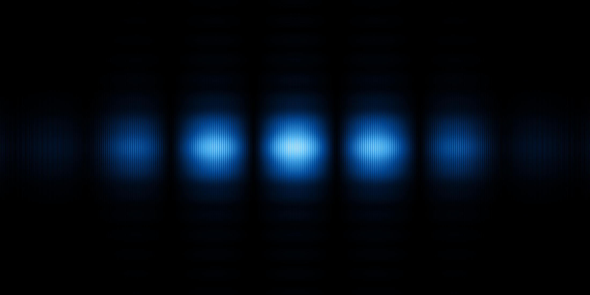
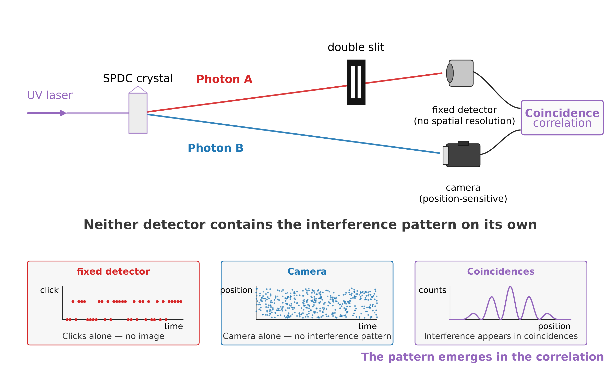
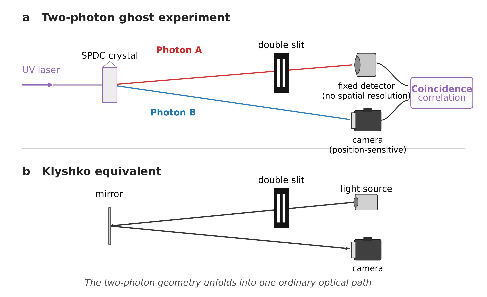
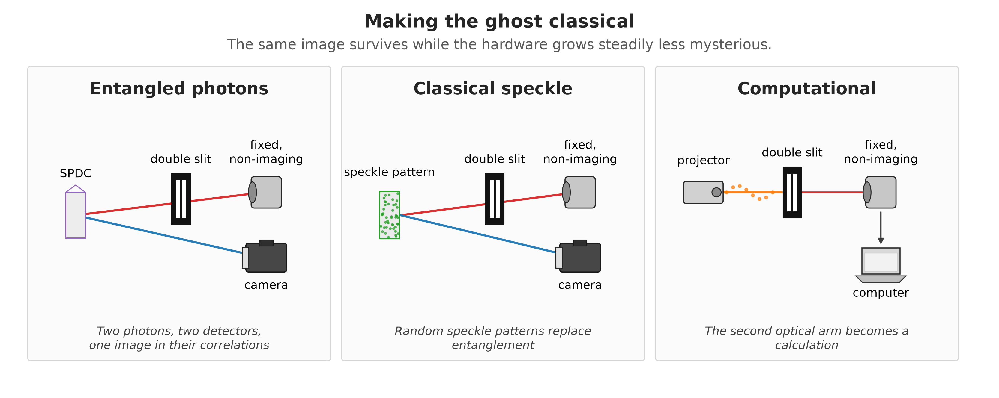

# Who Needs a Double Slit Anyway?

### *The double-slit experiment is the most famous demonstration in quantum physics. What happens when the photon making the fringes never passes through either slit?*

---

*Interference pattern from a double slit. Simulation by author.*

*Alt text: Blue-white double-slit interference pattern on a black background, with a bright central maximum and symmetric fringes.*

Every popular account of quantum mechanics eventually reaches the same climax. Send photons one at a time toward a pair of slits. Each photon arrives as a single dot on a screen. But after thousands of them, an interference pattern builds up — bright and dark bands that seem to require each photon to have somehow explored both paths.

As a physics student, I learned the double slit from textbooks, where the logic is wonderfully clean. A laboratory is less tidy.

Imagine removing the slits from the path of the photon that makes the pattern.

---

## The Photon That Never Saw the Slits

In 1995, physicists demonstrated something that looked almost impossible. Entangled photon pairs could produce an image at a detector whose photons had never interacted with the object at all [1].

The effect became known as **ghost imaging**, because of its strange division of labour. The light that touches the object is detected without forming an image, while the detector that does form the image receives light that never touched the object. The image exists only in the correlations between the two detection records.

That same year, another experiment pushed the idea into more familiar territory: replace the object with a double slit [2].

One photon passed through the slits and was collected by a detector with no spatial resolution — a fixed detector that merely registered whether a photon arrived. Its entangled partner travelled along a separate path to a position-sensitive detector.

Neither detector showed an interference pattern on its own.

But when the two detection records were compared, and only coincident events were kept, fringes appeared.

The photon whose position built up the interference pattern had never gone through either slit.

> **The photon that creates the interference pattern never passed through the slits. Its entangled partner did — and was detected by a device that recorded no image at all.**

**Figure 1. The ghost double-slit experiment.** One photon passes through a double slit and reaches a fixed detector with no spatial resolution. Its entangled partner travels directly to a position-sensitive detector. Neither detector reveals an interference pattern by itself. The fringes appear only when the two detection records are correlated. Image by author.

*Alt text: Schematic of a ghost interference experiment. A source produces entangled photon pairs. One path contains a double slit followed by a single-pixel fixed detector. The other path leads to a scanning detector. An arrow labelled "coincidences" connects the two detectors to a graph showing an interference pattern.*

---

## The Oldest Rule Still Applies

Anyone who knows the double-slit experiment also knows its most famous rule: find out which slit the photon went through, and the interference disappears.

The ghost version obeys the same rule, but now across two photons.

If the detection behind the slits is changed so that the measurement reveals which slit the first photon passed through, the fringes in the coincidence pattern disappear [3]. Nothing has changed in the other arm. The photon recorded there still never encounters the slits.

What changed is the information available in the joint measurement.

In the ordinary double-slit experiment, the path information and the fringes belong to the same photon. In the ghost experiment, the path information is recorded on one side, and the interference pattern appears on the other — yet the same trade-off survives.

The old quantum rule is still valid. It is just enforced nonlocally.

> **Which-path information kills interference — even when the path is here and the fringes are there.**

---

## How Does the Ghost Know About the Slits?

Klyshko [4,5] gives an elegant way to see why the experiment works.

Imagine running one arm of the experiment backwards. Replace the fixed detector with a light source and the nonlinear crystal with a mirror. Light now travels from the detector side, back through the double slit, reflects from the mirror, and continues along the second arm to the camera.

The strange two-photon experiment has unfolded into an ordinary optical system.

And that ordinary system reproduces the geometry and interference behaviour of the ghost experiment [4,5].

The Klyshko picture does not mean that a photon literally travels backwards in time. It is a calculational picture — but a remarkably useful one. Image position, magnification, and diffraction can suddenly be understood with familiar optics.

Which makes the next question difficult to avoid. If a classical optical picture predicts the ghost so well, how much of the effect is really quantum?

> **Unfold the entangled pair into a single classical light path, and ordinary optics predicts the ghost.**

**Figure 2. The Klyshko picture.** Top: the two-photon ghost experiment. Bottom: replace the fixed detector with a light source and the SPDC crystal with a mirror. The two arms then unfold into a single classical optical path through the double slit to the camera. Image by author.

*Alt text: Top: the two-photon ghost experiment. Bottom: replace the fixed detector with a light source and the SPDC crystal with a mirror, and the two arms unfold into a single classical optical path from the source, through the double slit, to the camera. The ordinary optical system reproduces the geometry of the ghost experiment.*

---

## Then the Entanglement Became Optional

So, how much of this effect is actually quantum? As it turns out, entanglement is not required to make a ghost image.

Take a laser and pass it through a rotating ground-glass screen. The result is a constantly changing speckle pattern. Split that pattern into two correlated copies with a beam splitter. Send one copy through the object to a fixed detector, and record the other with a camera.

Neither measurement is useful on its own. But correlate the detector signal with the recorded speckle patterns, and the image appears [6,7]. No entangled photons are involved.

Then researchers removed even more of the apparatus.

If the illumination patterns are generated deliberately with a spatial light modulator, the computer already knows exactly what was projected. The second beam no longer has to be measured at all [8,9].

Now the setup has collapsed to its essentials: a structured light source, the object, a single-pixel detector, and a computer.

The ghost image is still there.

What survived all these transformations was the correlation. In the original experiment, the correlations between the two beams came from entangled photon pairs. In the classical experiment, correlated fluctuations in a speckle pattern could do the job instead. What matters for forming the ghost is that a fluctuation in one arm tells us something about the corresponding light in the other. Entanglement can make those correlations stronger than any classical source allows — particularly when complementary quantities such as position and momentum are considered together — but entanglement is not required to form the image [4,7,9,10].

Even the word classical needs some care here. Thermal-light ghost imaging can be described quantitatively using classical electromagnetic fields and semiclassical photodetection [9]. Yet when the same light is analysed using quantum-information measures, quantum correlations such as discord can still be present, especially at low illumination [12]. So the boundary is not simply quantum photons versus classical light. It depends on what kind of correlation we ask the experiment to reveal.

> **Remove the entanglement. Remove the second beam. Replace the camera with a calculation. The ghost image remains.**

**Figure 3. Making the ghost classical.** Three stages of ghost imaging. Left: entangled photon pairs are measured in two arms. Centre: a beam splitter creates two classically correlated copies of a changing speckle pattern. Right: the second arm disappears entirely — known illumination patterns are projected onto the object, measured with a fixed, non-imaging detector and reconstructed by a computer. Image by author.

*Alt text: Three-panel diagram showing the progression from quantum to computational ghost imaging. In the left panel, an SPDC source produces entangled photon pairs; one photon passes through the object to a fixed, non-imaging detector while the other is detected spatially. In the centre panel, a beam splitter divides a random speckle field into two classically correlated beams, again using a fixed detector and a spatial detector. In the right panel, a projector sends known structured illumination patterns onto the object, a single fixed detector measures the transmitted light, and a computer reconstructs the image without a second optical arm.*

---

## But Where Did the Quantum Go?

So ghost imaging works without entanglement. Ghost interference can be reproduced without it too.

Case closed?

Not quite.

The ghost image itself is not the quantum test, but there is a more subtle distinction which appears when we ask more of the experiment.

D'Angelo and colleagues, for example, did not identify entanglement simply because they could produce a ghost image or an interference pattern. They used the same photon pairs to probe correlations in both position and momentum, and showed that the simultaneous strength of those correlations satisfied an EPR-type entanglement criterion [10].

> The ghost image is not the quantum test. The physics lies in what the correlations allow us to learn.

That is a much more demanding statement.

A classical system can reproduce a ghost image. It can reproduce ghost interference. But entangled photon pairs can possess exceptionally strong correlations in complementary spatial variables at once — the spatial version of the EPR correlations that made entanglement famous in the first place [4,10].

Ghost imaging has evolved from entangled photon pairs, through classically correlated speckle, to computational systems in which known illumination patterns interrogate an object one measurement at a time [8,9].

Recent work pushes the idea one step further. Instead of merely asking which patterns reconstruct an image, researchers are treating ghost imaging explicitly as an **information-acquisition problem**: use what has already been measured to choose the next illumination pattern so that the next detector result tells us as much as possible about what remains unknown [11].

The original mystery has therefore changed.

The question is no longer simply:

*How can a camera image something its photons never touched?*

It is:

*What kinds of correlations, and what kinds of information, can an imaging system exploit — and when does quantum physics actually let us learn more?*

As a student, the boundary between classical and quantum physics looked clean in the textbooks. Ghost imaging is a good reminder that Nature is in reality a lot more interesting.

---

## References

[1] T. B. Pittman, Y. H. Shih, D. V. Strekalov, and A. V. Sergienko, "Optical imaging by means of two-photon quantum entanglement," *Physical Review A* **52**, R3429 (1995).

[2] D. V. Strekalov, A. V. Sergienko, D. N. Klyshko, and Y. H. Shih, "Observation of two-photon 'ghost' interference and diffraction," *Physical Review Letters* **74**, 3600 (1995).

[3] P. Chingangbam and T. Qureshi, "Ghost interference and quantum erasure," *Progress of Theoretical Physics* **127**, 383–392 (2012).

[4] M. J. Padgett and R. W. Boyd, "An introduction to ghost imaging: quantum and classical," *Philosophical Transactions of the Royal Society A* **375**, 20160233 (2017).

[5] T. B. Pittman, D. V. Strekalov, D. N. Klyshko, M. H. Rubin, A. V. Sergienko, and Y. H. Shih, "Two-photon geometric optics," *Physical Review A* **53**, 2804 (1996).

[6] R. S. Bennink, S. J. Bentley, and R. W. Boyd, "'Two-photon' coincidence imaging with a classical source," *Physical Review Letters* **89**, 113601 (2002).

[7] A. Gatti, E. Brambilla, M. Bache, and L. A. Lugiato, "Ghost imaging with thermal light: comparing entanglement and classical correlation," *Physical Review Letters* **93**, 093602 (2004).

[8] J. H. Shapiro, "Computational ghost imaging," *Physical Review A* **78**, 061802(R) (2008).

[9] B. I. Erkmen and J. H. Shapiro, "Ghost imaging: from quantum to classical to computational," *Advances in Optics and Photonics* **2**, 405–450 (2010).

[10] M. D'Angelo, Y.-H. Kim, S. P. Kulik, and Y. Shih, "Identifying entanglement using quantum 'ghost' interference and imaging," *Physical Review Letters* **92**, 233601 (2004).

[11] J. Sun, C. Hu, Z. Bo, Z. Liu, M. Chen, L. Du, W. Liu, and S. Han, "Adaptive information-maximization encoding for ghost imaging — A general Bayesian framework under experimental physical constraints," arXiv:2601.15604v2 (2026).